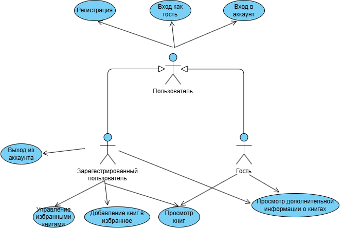

# Диаграмма вариантов использования

 

# Глоссарий

| Термин | Определение |
|:--|:--|
| Пользователь | Человек, использующий приложение |
| Гость | Пользователь, использующий приложение без регистрации |
| Зарегистрированный пользователь | Пользователь, прошедший регистрацию и вошедший в аккаунт |
| Книга | Объект, содержащий информацию о названии, авторе, годе и описании |
| Избранное | Список книг, добавленных зарегистрированным пользователем |

---

# Поток событий

# Содержание
1 [Актёры](#actors)  
2 [Варианты использования](#use_case)  
2.1 [Регистрация](#sign_up)  
2.2 [Вход в аккаунт](#sign_in)  
2.3 [Вход как гость](#sign_in_as_guest)  
2.4 [Просмотреть список книг](#view_book_list)  
2.5 [Просмотреть информацию о книге](#view_book_info)  
2.6 [Добавить книгу в избранное](#add_book_to_favorites)  
2.7 [Удалить книгу из избранного](#remove_book_from_favorites)  
2.8 [Просмотреть избранное](#view_favorites)  
2.9 [Выход из аккаунта](#sign_out)  

---

<a name="actors"/>

# 1 Актёры

| Актёр | Описание |
|:--|:--|
| Пользователь | Любой человек, использующий приложение |
| Гость | Пользователь, не вошедший в систему |
| Зарегистрированный пользователь | Пользователь, прошедший регистрацию и вошедший в систему |

---

<a name="use_case"/>

# 2 Варианты использования

<a name="sign_up"/>

## 2.1 Регистрация

**Описание.** Вариант использования "Регистрация" позволяет пользователю создать новую учётную запись.  
**Предусловия.** Пользователь выбрал пункт "Регистрация" на экране входа.  
**Основной поток.**
1. Приложение отображает окно регистрации с полями ввода имени (и при необходимости пароля/почты);
2. Пользователь вводит данные и подтверждает регистрацию;
3. Приложение проверяет, существует ли пользователь с таким именем;
4. Если имя свободно, создаётся новая учётная запись;
5. Приложение сообщает об успешной регистрации;
6. Вариант использования завершается.

**Альтернативный поток А1.**
1. Если пользователь с таким именем уже существует, приложение сообщает об ошибке;
2. Пользователь может ввести другое имя и повторить попытку.

---

<a name="sign_in"/>

## 2.2 Вход в аккаунт

**Описание.** Позволяет зарегистрированному пользователю войти в свою учётную запись.  
**Предусловия.** Пользователь зарегистрирован в системе.  
**Основной поток.**
1. Приложение отображает форму входа;
2. Пользователь вводит имя и пароль;
3. Приложение проверяет данные;
4. При успешной проверке пользователь получает доступ к функционалу зарегистрированного пользователя;
5. Вариант использования завершается.

**Альтернативный поток А1.**
1. При неверных данных приложение сообщает об ошибке;
2. Пользователь может повторить попытку входа.

---

<a name="sign_in_as_guest"/>

## 2.3 Вход как гость

**Описание.** Позволяет пользователю войти в приложение без регистрации.  
**Предусловия.** Пользователь не входил в аккаут.  
**Основной поток.**
1. Приложение присваивает пользователю статус "гость";
2. Пользователь получает доступ к ограниченному функционалу (просмотр книг, поиск, информация);
3. Вариант использования завершается.

---

<a name="view_book_list"/>

## 2.4 Просмотреть список книг

**Описание.** Позволяет пользователю просматривать список всех доступных книг.  
**Предусловия.** Пользователь вошёл в приложение (как гость или зарегистрированный).  
**Основной поток.**
1. Приложение получает список книг из базы данных;
2. Отображает книги в таблице или списке;
3. Пользователь может выбрать книгу для просмотра подробностей;
4. Вариант использования завершается.

---

<a name="view_book_info"/>

## 2.5 Просмотреть информацию о книге

**Описание.** Позволяет пользователю просмотреть полное описание выбранной книги.  
**Предусловия.** Пользователь выбрал книгу из списка.  
**Основной поток.**
1. Приложение получает детальную информацию о книге;
2. Отображает окно с названием, автором, годом и описанием;
3. Вариант использования завершается.

---

<a name="add_book_to_favorites"/>

## 2.6 Добавить книгу в избранное

**Описание.** Позволяет зарегистрированному пользователю добавить выбранную книгу в список избранных.  
**Предусловия.** Пользователь вошёл в аккаунт.  
**Основной поток.**
1. Пользователь выбирает книгу и нажимает "Звёздочку";
2. Приложение добавляет книгу в список избранных пользователя;
3. Обновлённый список сохраняется в базе данных;
4. Вариант использования завершается.

**Альтернативный поток А1.**
1. Если книга уже в избранном, приложение сообщает пользователю.

---

<a name="remove_book_from_favorites"/>

## 2.7 Удалить книгу из избранного

**Описание.** Позволяет зарегистрированному пользователю удалить книгу из списка избранных.  
**Предусловия.** Пользователь вошёл в аккаунт и имеет книги в избранном.  
**Основной поток.**
1. Пользователь выбирает книгу из списка избранных;
2. Нажимает "Закрашенную звёздочку";
3. Приложение удаляет книгу из списка;
4. Обновлённый список сохраняется;
5. Вариант использования завершается.

---

<a name="view_favorites"/>

## 2.8 Просмотреть избранное

**Описание.** Позволяет зарегистрированному пользователю просмотреть список добавленных в избранное книг.  
**Предусловия.** Пользователь вошёл в аккаунт.  
**Основной поток.**
1. Приложение получает список избранных книг из базы данных;
2. Отображает его в виде таблицы;
3. Вариант использования завершается.

---

<a name="sign_out"/>

## 2.9 Выход из аккаунта

**Описание.** Позволяет зарегистрированному пользователю выйти из учётной записи.  
**Предусловия.** Пользователь вошёл в аккаунт.  
**Основной поток.**
1. Пользователь выбирает пункт меню "Выход";
2. Приложение очищает текущую сессию;
3. Возвращает пользователя на экран входа;
4. Вариант использования завершается.
