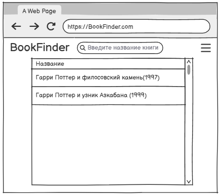
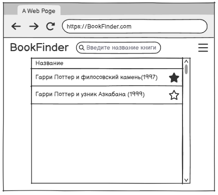
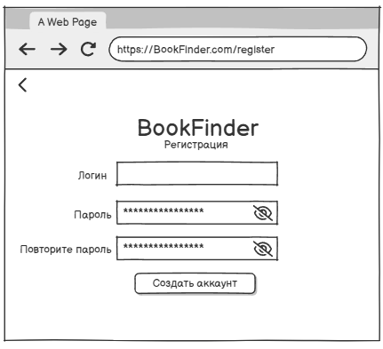
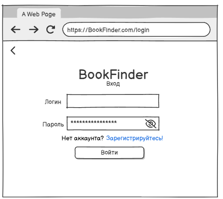
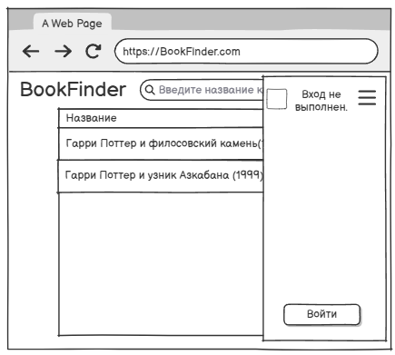
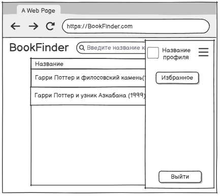
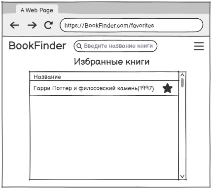
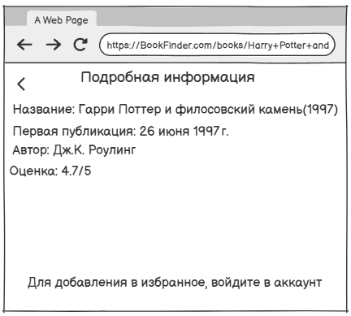
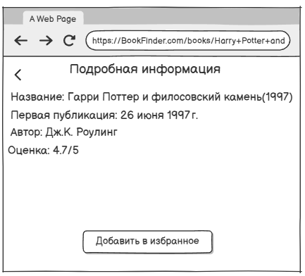

# Требования к проекту
# Содержание
1 [Введение](#1-Введение)  
1.1 Назначение  
1.2 Бизнес-требования  
1.2.1 Исходные данные  
1.2.2 Возможности бизнеса  
1.2.3 Границы проекта  
1.3 Аналоги  
2 Требования пользователя  
2.1 Программные интерфейсы  
2.2 Интерфейс пользователя  
2.3 Характеристики пользователей  
2.3.1 Классы пользователей  
2.3.2 Аудитория приложения  
2.3.2.1 Целевая аудитория  
2.3.2.1 Побочная аудитория  
2.4 Предположения и зависимости  
3 Системные требования  
3.1 Функциональные требования  
3.1.1 Основные функции  
3.1.1.1 Вход пользователя в приложение  
3.1.1.2 Настройка профиля активного пользователя  
3.1.1.3 Загрузка новостей  
3.1.1.4 Просмотр информации об отдельной новости  
3.1.1.5 Выход пользователя из учётной записи  
3.1.1.6 Регистрация нового пользователя после входа в приложение  
3.1.2 Ограничения и исключения  
3.2 Нефункциональные требования  
3.2.1 Атрибуты качества  
3.2.1.1 Требования к удобству использования  
3.2.1.2 Требования к безопасности  
3.2.1.3 Требования к доступности  
3.2.2 Внешние интерфейсы  
3.2.3 Ограничения  

## 1 Введение

### 1.1 Назначение
В этом документе описаны функциональные и нефункциональные требования к приложению FindBook для веб-браузера. Этот документ предназначен для команды, которая будет реализовывать и проверять корректность работы приложения.
 
### 1.2 Бизнес-требования

#### 1.2.1 Исходные данные
Большое количество людей увлекается чтением и ведёт списки прочитанных или планируемых книг. Однако часто пользователи ведут такие списки вручную (в блокнотах, таблицах или заметках), что неудобно и не позволяет быстро находить нужную информацию.
Существующие сервисы для работы с книгами (Goodreads, MyBook, Bookmate) требуют обязательной регистрации и, как правило, ориентированы либо на социальное взаимодействие, либо на продажу и чтение книг онлайн. Пользователю, который хочет просто искать книги и при необходимости сохранять их в личное избранное, зачастую приходится использовать перегруженные сервисы.

#### 1.2.2 Возможности бизнеса
Простое веб-приложение позволит пользователям:
+ искать книги по названию без необходимости авторизации;
+ при желании зарегистрироваться и сохранять книги в раздел «Избранное»;
+ вести личную коллекцию без лишнего функционала и подписок.
Такой сервис будет полезен широкой аудитории — от студентов и школьников до взрослых пользователей, которым нужен быстрый доступ к информации о книгах.

#### 1.2.3 Границы проекта
Гости: могут искать книги и просматривать информацию о них.
Авторизованные пользователи: дополнительно могут добавлять книги в избранное.
Приложение не предназначено для онлайн-чтения книг или их покупки — оно выполняет функцию каталогизации и поиска.

### 1.3 Аналоги
Аналогами являются сервисы:
+ Goodreads — популярный каталог книг с отзывами и рейтингами. Недостаток: требует регистрации, перегружен социальными функциями.
+ MyBook — сервис для чтения книг по подписке. Недостаток: коллекция — второстепенная функция, большинство возможностей доступно только по платной подписке.
+ Bookmate — ориентирован на чтение и аренду книг, а не на ведение личной коллекции. Недостаток: требуется аккаунт и подписка.
+ Google Sheets / Excel — можно вручную вести список книг, но поиск и удобный интерфейс отсутствуют.
Преимущества нашего проекта:
возможность искать книги без авторизации, чего нет у аналогов;
простота и лёгкость интерфейса (только поиск и коллекция, без перегрузки социальными функциями);
бесплатный доступ к основному функционалу без подписок;
дополнительные возможности для авторизованных пользователей (избранное), при этом регистрация остаётся необязательной.

## 2 Требования пользователя

### 2.1 Программные интерфейсы

Приложение использует внутреннюю базу данных, содержащую информацию о книгах. При расширении функциональности может быть подключено к публичным сервисам (например, Google Books API).

### 2.2 Интерфейс пользователя

Главное меню без авторизации.  
  

Главное меню с авторизацией.  

Окно регистрации.  

Окно входа.  

Панель главного меню без авторизации.  

Панель главного меню с авторизацией.  

Список избанных книг.  

Подробная информация о книге без авторизации.  

Подробная информация о книге с авторизацией.  

### 2.3 Характеристики пользователей

#### 2.3.1 Классы пользователей

| Класс пользователей        | Описание |
|-----------------------------|----------|
| Гости                       | Пользователи, которые не хотят регистрироваться в приложении. Имеют доступ к частичному функционалу: могут искать книги и просматривать информацию о них. |
| Зарегистрированные пользователи | Пользователи, которые вошли в приложение под своей учётной записью. Имеют доступ к полному функционалу: могут искать книги, просматривать их описание, а также добавлять книги в «Избранное» и управлять своей личной коллекцией. |

#### 2.3.2 Аудитория приложения

##### 2.3.2.1 Целевая аудитория

Люди, увлекающиеся чтением книг и желающие иметь удобный инструмент для поиска и ведения личной коллекции.

##### 2.3.2.2 Побочная аудитория

Пользователи, которые не являются активными читателями, но могут использовать приложение для поиска отдельных книг (например, для учёбы или работы).

### 2.4 Предположения и зависимости

Приложение не может добавлять книги в личную коллекцию при отсутствии подключения к Интернету.
Приложение не может просматривать данные о книгах, отсутствующих в локальной коллекции, без доступа к интернет-ресурсам (например, Google Books API).

## 3 Системные требования

### 3.1 Функциональные требования

#### 3.1.1 Основные функции

##### 3.1.1.1 Вход пользователя в приложение

Пользователь имеет возможность использовать приложение без регистрации или войти в свою учётную запись.  

| Функция                          | Требования |
|----------------------------------|-------------|
| Вход без регистрации             | Приложение должно позволять пользователю сразу использовать поиск и просмотр книг без авторизации. |
| Регистрация нового пользователя  | Приложение должно запросить у пользователя ввод имени (и, при необходимости, пароля/почты) для создания учётной записи. |
| Пользователь с таким именем существует | Приложение должно сообщить об ошибке и предложить повторить регистрацию. |
| Вход зарегистрированного пользователя | Приложение должно позволять авторизованному пользователю войти под своей учётной записью. |

##### 3.1.1.2 Настройка профиля активного пользователя

Зарегистрированный пользователь имеет возможность управлять своей личной коллекцией.  

| Функция                | Требования |
|-------------------------|-------------|
| Добавление книги в избранное | Приложение должно позволять зарегистрированному пользователю добавить выбранную книгу в список избранных. |
| Удаление книги из избранного | Пользователь должен иметь возможность удалить книгу из списка. |

##### 3.1.1.3 Загрузка списка книг

После входа пользователя в приложение или изменения коллекции загружается актуальный список избранных книг.  

| Функция                | Требования |
|-------------------------|-------------|
| Загрузка информации о книгах | Приложение должно загружать список избранных книг пользователя и отображать их в отсортированном виде (например, по названию). |

##### 3.1.1.4 Просмотр информации об отдельной книге

Пользователь имеет возможность просмотреть информацию о каждой книге.  

Функция	Требования
Просмотр информации о книге	При выборе книги приложение должно открыть окно с подробной информацией (название, автор, год издания, описание).

##### 3.1.1.5 Выход пользователя из учётной записи

Зарегистрированный пользователь имеет возможность выйти из учётной записи.  

| Функция                | Требования |
|-------------------------|-------------|
| Выход из учётной записи | Приложение должно предоставить пользователю возможность выйти с возвратом к экрану входа. |

##### 3.1.1.6 Регистрация нового пользователя после входа в приложение

Гость имеет возможность зарегистрироваться в приложении.  

| Требование |
|-------------|
| Приложение должно предоставить анонимному пользователю возможность зарегистрироваться и перейти к расширенному функционалу. |

#### 3.1.2 Ограничения и исключения

Добавление книг в избранное возможно только при наличии подключения к Интернету.
Просмотр информации о книгах, которых нет в локальной коллекции, возможен только при наличии данных в внешнем источнике (например, Google Books API).

### 3.2 Нефункциональные требования

#### 3.2.1 Атрибуты качества

##### 3.2.1.1 Требования к удобству использования

Интерфейс должен быть интуитивно понятным.
Все элементы интерфейса должны иметь описательные названия.
Интерфейс не должен содержать лишних элементов.

##### 3.2.1.2 Требования к безопасности

Просмотр личной коллекции доступен только активному пользователю.
Управление (добавление/удаление) книг в коллекции возможно только авторизованным пользователем.

##### 3.2.1.3 Требования к доступности

Время реакции на действия пользователя должно быть минимальным.

#### 3.2.2 Внешние интерфейсы

Интерфейс приложения должен быть простым и удобным.
Размер шрифта и элементы управления должны быть оптимальны для отображения в веб-браузере.

#### 3.2.3 Ограничения

Приложение реализовано как веб-приложение.
Язык реализации — Java (Spring Boot).
